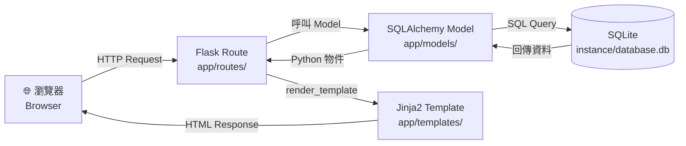
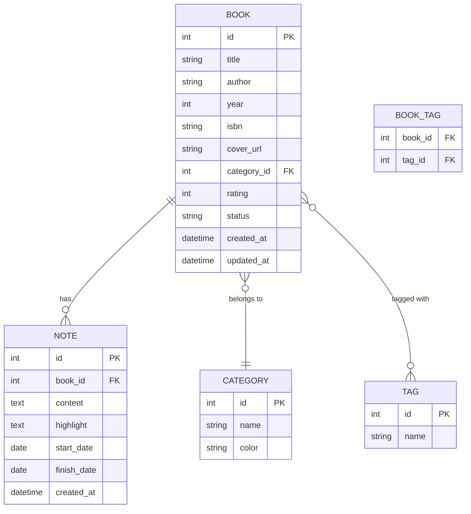

# 讀書筆記本 系統 — 系統架構文件（ARCHITECTURE）

**版本：** v1.0  
**撰寫日期：** 2026-04-15  
**對應 PRD：** docs/PRD.md v1.0

---

## 1. 技術架構說明

### 1.1 選用技術與原因

| 技術 | 版本建議 | 選用原因 |
|---|---|---|
| **Python** | 3.10+ | 語法簡潔，生態豐富，適合初學者與快速開發 |
| **Flask** | 3.x | 輕量級 Web 框架，學習曲線低，彈性高 |
| **Jinja2** | （Flask 內建）| Flask 官方模板引擎，與 Python 語法相近，易上手 |
| **SQLite** | （Python 內建）| 零配置資料庫，無需額外安裝，適合單人使用的本機專案 |
| **SQLAlchemy** | 2.x | ORM 框架，用 Python 物件操作資料庫，避免手寫 SQL 出錯 |
| **Flask-WTF** | 1.x | 表單驗證 + CSRF 保護，提升安全性 |
| **Vanilla CSS** | — | 不依賴外部 CSS 框架，完全掌控樣式 |

### 1.2 Flask MVC 模式說明

本專案採用 **MVC（Model-View-Controller）** 架構：

| 層級 | 對應技術 | 職責說明 |
|---|---|---|
| **Model** | `app/models/` + SQLAlchemy | 定義資料結構（書籍、筆記、分類），負責所有資料庫存取邏輯 |
| **View** | `app/templates/` (Jinja2 HTML) | 負責 UI 渲染，接收 Controller 傳入的資料並呈現給使用者 |
| **Controller** | `app/routes/` (Flask Blueprint) | 接收 HTTP 請求，呼叫 Model 取得資料，再交給 View 渲染回應 |

---

## 2. 專案資料夾結構

```
reading-notes/                  ← 專案根目錄
│
├── app/                        ← 主應用程式套件
│   ├── __init__.py             ← Flask app 初始化（create_app 工廠函式）
│   │
│   ├── models/                 ← Model 層：資料庫模型（SQLAlchemy）
│   │   ├── __init__.py
│   │   ├── book.py             ← Book 模型（書名、作者、評分…）
│   │   ├── note.py             ← Note 模型（心得、摘錄、閱讀狀態）
│   │   ├── category.py         ← Category 模型（分類）
│   │   └── tag.py              ← Tag 模型（標籤）
│   │
│   ├── routes/                 ← Controller 層：Flask Blueprint 路由
│   │   ├── __init__.py
│   │   ├── main.py             ← 首頁、儀表板路由
│   │   ├── books.py            ← 書籍 CRUD 路由
│   │   ├── notes.py            ← 心得 CRUD 路由
│   │   ├── categories.py       ← 分類管理路由
│   │   └── search.py           ← 搜尋功能路由
│   │
│   ├── templates/              ← View 層：Jinja2 HTML 模板
│   │   ├── base.html           ← 基礎模板（導覽列、頁尾、共用 CSS）
│   │   ├── index.html          ← 首頁 / 儀表板
│   │   ├── books/
│   │   │   ├── list.html       ← 書單列表頁
│   │   │   ├── detail.html     ← 書籍詳情頁
│   │   │   ├── create.html     ← 新增書籍表單
│   │   │   └── edit.html       ← 編輯書籍表單
│   │   ├── notes/
│   │   │   ├── create.html     ← 新增心得表單
│   │   │   └── edit.html       ← 編輯心得表單
│   │   ├── categories/
│   │   │   └── list.html       ← 分類管理頁
│   │   └── search/
│   │       └── results.html    ← 搜尋結果頁
│   │
│   ├── static/                 ← 靜態資源（CSS / JS / 圖片）
│   │   ├── css/
│   │   │   └── style.css       ← 主要樣式表
│   │   ├── js/
│   │   │   └── main.js         ← 互動功能（星星評分、標籤輸入）
│   │   └── images/
│   │       └── default_cover.png ← 預設書籍封面
│   │
│   └── forms.py                ← Flask-WTF 表單定義（書籍、心得表單）
│
├── instance/                   ← 實例資料夾（不納入 Git）
│   └── database.db             ← SQLite 資料庫檔案
│
├── docs/                       ← 文件資料夾
│   ├── PRD.md                  ← 產品需求文件
│   └── ARCHITECTURE.md         ← 本架構文件
│
├── tests/                      ← 測試程式
│   ├── test_books.py
│   └── test_search.py
│
├── app.py                      ← 程式進入點（run Flask app）
├── config.py                   ← 設定檔（資料庫路徑、Secret Key）
├── requirements.txt            ← Python 套件清單
└── .gitignore                  ← Git 忽略設定（含 instance/）
```

---

## 3. 元件關係圖

### 3.1 請求處理流程



### 3.2 資料模型關聯圖



---

## 4. 關鍵設計決策

### 決策一：使用 Flask Blueprint 組織路由

**決策：** 將不同功能的路由拆分到獨立的 Blueprint（books、notes、categories、search）。  
**原因：** 避免所有路由都擠在同一個檔案，降低耦合度，方便不同組員分工開發不同模組。

---

### 決策二：採用 Application Factory Pattern（`create_app`）

**決策：** 在 `app/__init__.py` 使用工廠函式建立 Flask 實例，而非直接用全域變數。  
**原因：** 方便在未來切換測試環境與正式環境的設定（`config.py`），也便於撰寫單元測試。

---

### 決策三：使用 SQLAlchemy ORM 而非裸 SQL

**決策：** 資料庫存取層統一使用 SQLAlchemy，不直接撰寫 SQL 字串。  
**原因：** ORM 能自動防止 SQL Injection，程式碼更易讀，也更容易在未來切換到 PostgreSQL 等資料庫。

---

### 決策四：`instance/` 資料夾存放資料庫，並加入 `.gitignore`

**決策：** SQLite 資料庫檔案置於 `instance/database.db`，不納入版本控制。  
**原因：** 資料庫是執行期產生的資料，不應儲存在 Git 中，避免洩漏用戶資料或產生 merge conflict。

---

### 決策五：全文搜尋使用 SQLite `LIKE` 查詢

**決策：** 搜尋功能透過 SQLAlchemy 的 `LIKE` 條件跨欄位（書名、作者、心得、標籤）查詢，不引入額外的搜尋引擎。  
**原因：** 專案規模屬單人使用，資料量有限，SQLite `LIKE` 查詢已足夠應付需求，避免過度工程化（Over-engineering）。若未來資料量大，可考慮引入 SQLite FTS5 或 Elasticsearch。

---

## 5. 開發環境設定

```bash
# 1. 建立虛擬環境
python -m venv venv

# 2. 啟動虛擬環境（Windows）
venv\Scripts\activate

# 3. 安裝套件
pip install -r requirements.txt

# 4. 啟動開發伺服器
python app.py
# 或
flask --app app run --debug
```

### `requirements.txt` 核心套件

```
Flask>=3.0
Flask-SQLAlchemy>=3.0
Flask-WTF>=1.2
```

---

*本文件依據 PRD v1.0 撰寫，若功能需求有異動，請同步更新架構圖與資料夾結構。*
