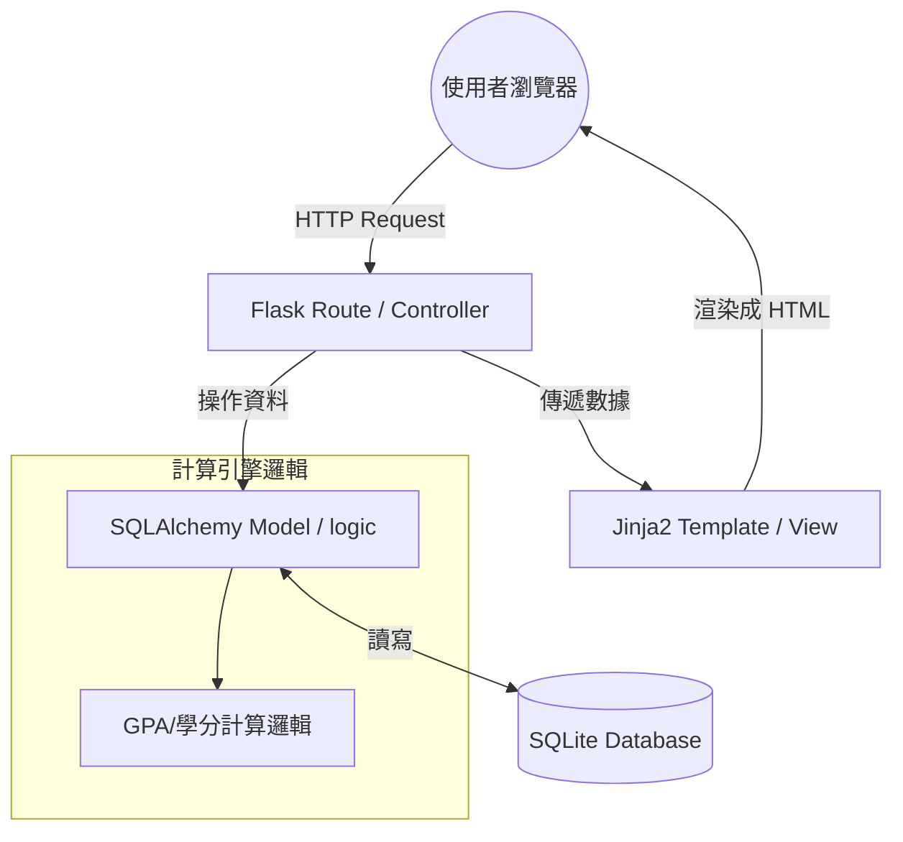

# 系統架構設計 (Architecture Design)

## 1. 技術架構說明

本專案採用典型的 **Flask MVC (Model-View-Controller)** 架構模式。各元件職責如下：

- **Model (模型)**：由 Python 類別定義，透過 SQLAlchemy 與 SQLite 資料庫互動，負責資料的儲存、讀取與核心計算邏輯（如 GPA 計算演算法）。
- **View (視圖)**：由 Jinja2 模板組成，負責呈現 HTML 頁面給使用者，並使用 Vanilla CSS 進行美化。
- **Controller (控制器/路由)**：Flask 的 Route 函式，負責接收使用者的請求 (HTTP Request)，調用 Model 進行資料處理，最後選擇適當的 View 進行渲染並回傳。

### 技術選型
- **後端框架**：Flask (輕量、靈活、適合快速開發)。
- **模板引擎**：Jinja2 (與 Flask 完美整合，支援伺服器端渲染)。
- **資料庫**：SQLite (無需額外安裝伺服器，適合本機開發與中小型應用)。
- **樣式設計**：Vanilla CSS (現代 CSS3 語法提供強大的動畫與佈局能力)。

---

## 2. 專案資料夾結構

```text
web_app_development/
├── app/
│   ├── __init__.py         # 應用程式工廠，初始化 Flask 與內容插件
│   ├── models/             # 資料庫模型 (Model)
│   │   ├── __init__.py
│   │   ├── course.py       # 課程與學分紀錄模型
│   │   └── user.py         # (未來擴充) 使用者模型
│   ├── routes/             # 路由處理 (Controller)
│   │   ├── __init__.py
│   │   ├── main.py         # 首頁與導覽路由
│   │   └── calculator.py   # 計算引擎核心路由
│   ├── static/             # 靜態資源
│   │   ├── css/            # Vanilla CSS 樣式表
│   │   │   └── style.css
│   │   └── js/             # 前端互動邏輯 (如動態新增欄位)
│   │       └── main.js
│   └── templates/          # HTML 模板 (View)
│       ├── base.html       # 基礎版型
│       ├── index.html      # 儀表板首頁
│       └── calculator.html # 計算器頁面
├── instance/               # 實例資料夾
│   └── database.db         # SQLite 資料庫檔案
├── docs/                   # 專案文件
├── app.py                  # 專案啟動入口
├── config.py               # 專案變數配置
└── requirements.txt        # 相依套件清單
```

---

## 3. 元件關係圖


```mermaid
graph TD
    User((使用者瀏覽器)) -->|HTTP Request| Route[Flask Route / Controller]
    Route -->|操作資料| Model[SQLAlchemy Model / logic]
    Model <-->|讀寫| DB[(SQLite Database)]
    Route -->|傳遞數據| Template[Jinja2 Template / View]
    Template -->|渲染成 HTML| User
    
    subgraph 計算引擎邏輯
        Model --> Calculate[GPA/學分計算邏輯]
    end
```

---

## 4. 關鍵設計決策

1.  **伺服器端渲染 (SSR)**：選用 Jinja2 而非 React/Vue，是為了降低前端複雜度，利用 Flask 的核心能力快速交付功能。
2.  **核心邏輯封裝於 Model**：GPA 轉換與學分加總的邏輯將寫在 Model 的 Method 或獨立的 Service 中，確保與 UI 邏輯分離，易於測試。
3.  **單一檔案樣式管理**：初期使用單一 `style.css` 搭配現代 CSS 變量 (Variables) 建立設計系統，維持 Premium 的視覺體驗且易於維護。
4.  **動態表單交互**：使用 Vanilla JS 處理前端的「新增課程行」，不需要重新整理頁面即可增加輸入框，提升使用者體驗。
