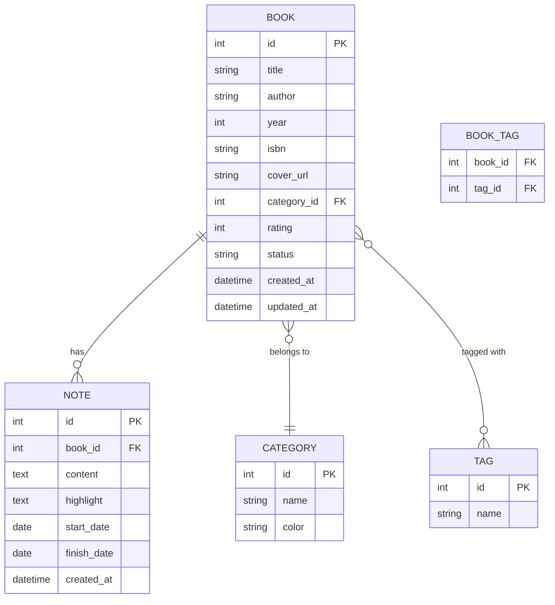

# 資料庫設計文件 (DB_DESIGN)

## 1. ER 圖（實體關係圖）

## 2. 資料表詳細說明

### BOOK（書籍表）
儲存書籍的基本資料與目前的閱讀狀態。
- `id` (INTEGER): 主鍵，自動遞增。
- `title` (VARCHAR(200)): 書名，必填。
- `author` (VARCHAR(100)): 作者，選填。
- `year` (INTEGER): 出版年份，選填。
- `isbn` (VARCHAR(20)): ISBN，選填。
- `cover_url` (VARCHAR(500)): 封面圖片網址，選填。
- `category_id` (INTEGER): 外鍵，關聯至 `CATEGORY.id`，選填。
- `rating` (INTEGER): 評分 (1-5)，選填。
- `status` (VARCHAR(20)): 閱讀狀態 (例如: 想讀, 閱讀中, 已讀完)，必填。
- `created_at` (DATETIME): 建立時間，必填。
- `updated_at` (DATETIME): 更新時間，必填。

### NOTE（閱讀心得表）
每本書可有多筆閱讀心得或重點筆記。
- `id` (INTEGER): 主鍵，自動遞增。
- `book_id` (INTEGER): 外鍵，關聯至 `BOOK.id`，必填。
- `content` (TEXT): 心得內容，選填。
- `highlight` (TEXT): 重點摘錄，選填。
- `start_date` (DATE): 閱讀開始日，選填。
- `finish_date` (DATE): 閱讀完成日，選填。
- `created_at` (DATETIME): 建立時間，必填。

### CATEGORY（書籍分類表）
書籍的分類 (1本對應1個分類)。
- `id` (INTEGER): 主鍵，自動遞增。
- `name` (VARCHAR(50)): 分類名稱，必填，需唯一。
- `color` (VARCHAR(20)): 分類標籤顏色，選填。

### TAG（書籍標籤表）
自訂標籤。
- `id` (INTEGER): 主鍵，自動遞增。
- `name` (VARCHAR(50)): 標籤名稱，必填，需唯一。

### BOOK_TAG（書籍標籤關聯表）
多對多關聯中介表。
- `book_id` (INTEGER): 外鍵，關聯至 `BOOK.id`，必填。
- `tag_id` (INTEGER): 外鍵，關聯至 `TAG.id`，必填。

## 3. SQL 建表語法

完整建表語法請參考 `database/schema.sql`。
