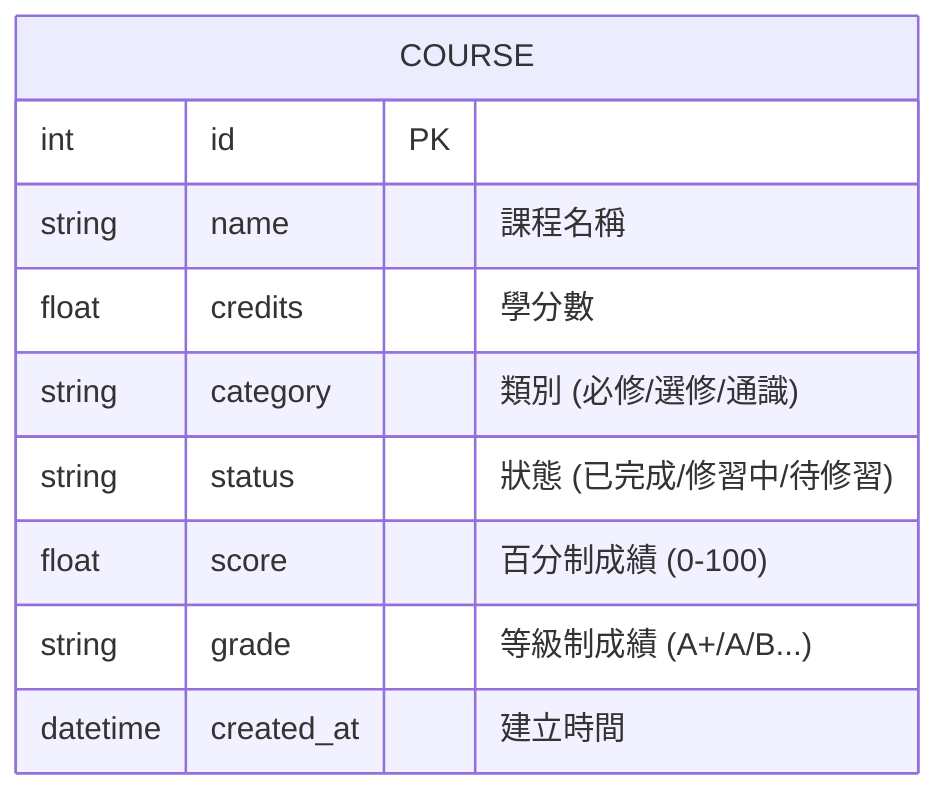

# 資料庫設計 (Database Design)

## 1. ER 圖 (Entity Relationship Diagram)


```mermaid
erDiagram
    COURSE {
        int id PK
        string name "課程名稱"
        float credits "學分數"
        string category "類別 (必修/選修/通識)"
        string status "狀態 (已完成/修習中/待修習)"
        float score "百分制成績 (0-100)"
        string grade "等級制成績 (A+/A/B...)"
        datetime created_at "建立時間"
    }
```

---

## 2. 資料表詳細說明

### COURSE (課程紀錄表)

| 欄位名稱 | 型別 | 說明 | 必填 | 備註 |
| :--- | :--- | :--- | :--- | :--- |
| id | INTEGER | 流水編號 (PK) | 是 | 自動遞增 |
| name | TEXT | 課程名稱 | 是 | |
| credits | REAL | 學分數 | 是 | |
| category | TEXT | 課程類別 | 是 | 必修, 選修, 通識 |
| status | TEXT | 修習狀態 | 是 | 已完成, 修習中, 待修習 |
| score | REAL | 百分制成績 | 否 | 0.0 - 100.0 |
| grade | TEXT | 等級制成績 | 否 | A+, A, A-, B+... |
| created_at | DATETIME | 紀錄建立時間 | 是 | 預設為 CURRENT_TIMESTAMP |

---

## 3. SQL 建表語法

儲存於 `database/schema.sql`：

```sql
CREATE TABLE IF NOT EXISTS courses (
    id INTEGER PRIMARY KEY AUTOINCREMENT,
    name TEXT NOT NULL,
    credits REAL NOT NULL,
    category TEXT NOT NULL,
    status TEXT NOT NULL,
    score REAL,
    grade TEXT,
    created_at DATETIME DEFAULT CURRENT_TIMESTAMP
);
```

---

## 4. Python Model 程式碼設計

- **檔案路徑**：`app/models/course.py`
- 包含 GPA 轉換邏輯與基礎 CRUD 操作。
