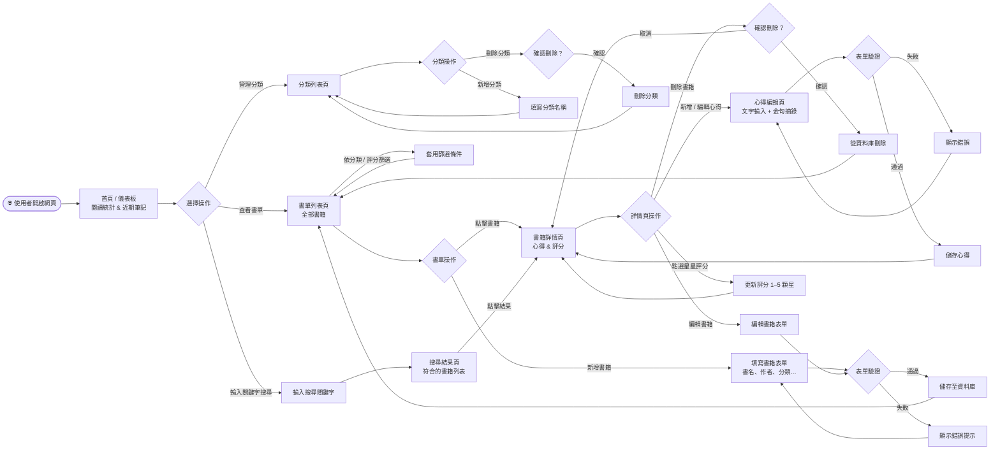
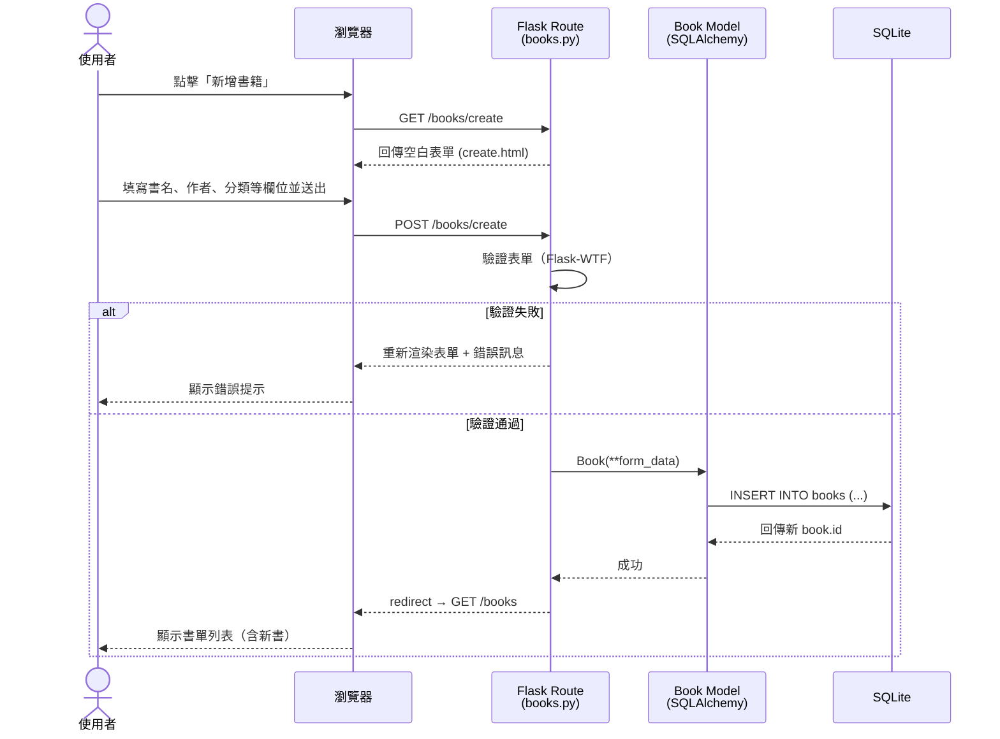
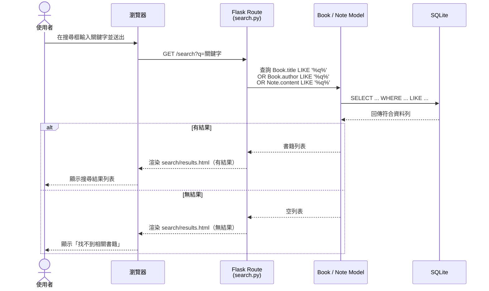
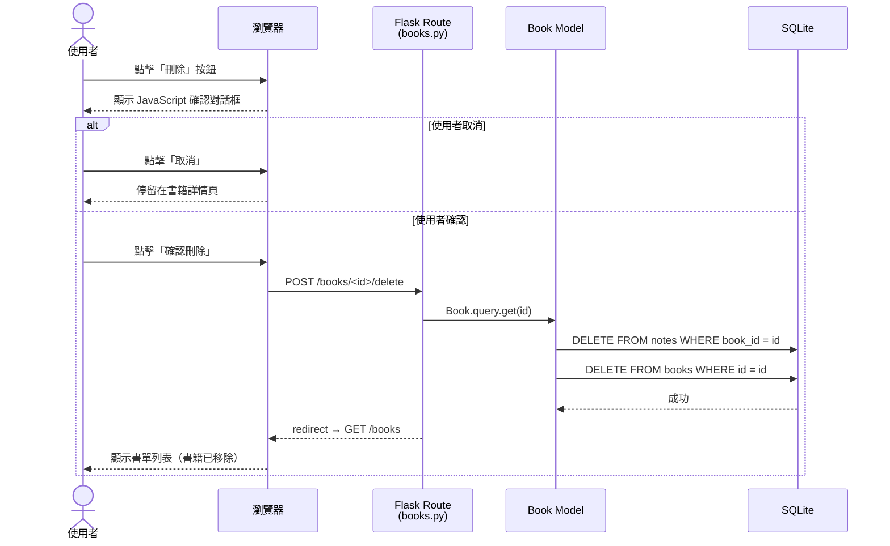

# 讀書筆記本 系統 — 流程圖文件（FLOWCHART）

**版本：** v1.0  
**撰寫日期：** 2026-04-15  
**對應文件：** docs/PRD.md v1.0、docs/ARCHITECTURE.md v1.0

---

## 1. 使用者流程圖（User Flow）

> 描述使用者從進入網站到完成各項操作的完整路徑。

---

## 2. 系統序列圖（Sequence Diagram）

### 2.1 新增書籍

> 描述使用者填寫書籍表單、送出，到資料成功儲存並導回書單的完整系統互動。

---

### 2.2 關鍵字搜尋

> 描述使用者輸入關鍵字，系統跨欄位查詢並回傳結果的流程。

---

### 2.3 刪除書籍

> 描述使用者確認刪除後，系統從資料庫移除書籍及相關心得的流程。

---

## 3. 功能清單對照表

| 功能 | URL 路徑 | HTTP 方法 | 對應說明 |
|---|---|---|---|
| 首頁 / 儀表板 | `/` | GET | 顯示閱讀統計與近期筆記 |
| 書單列表 | `/books` | GET | 顯示所有書籍（支援分類篩選）|
| 新增書籍表單 | `/books/create` | GET | 顯示空白新增表單 |
| 儲存新書籍 | `/books/create` | POST | 驗證並儲存書籍至資料庫 |
| 書籍詳情 | `/books/<id>` | GET | 顯示書籍詳情、心得、評分 |
| 編輯書籍表單 | `/books/<id>/edit` | GET | 顯示預填編輯表單 |
| 更新書籍 | `/books/<id>/edit` | POST | 驗證並更新書籍資料 |
| 刪除書籍 | `/books/<id>/delete` | POST | 刪除書籍及其心得 |
| 新增心得 | `/books/<id>/notes/create` | GET / POST | 新增閱讀心得 |
| 編輯心得 | `/notes/<id>/edit` | GET / POST | 編輯既有心得 |
| 刪除心得 | `/notes/<id>/delete` | POST | 刪除單筆心得 |
| 分類列表 | `/categories` | GET | 顯示所有分類 |
| 新增分類 | `/categories/create` | POST | 新增分類 |
| 刪除分類 | `/categories/<id>/delete` | POST | 刪除分類 |
| 關鍵字搜尋 | `/search?q=<keyword>` | GET | 全文搜尋書名、作者、心得 |

---

*本文件依據 PRD v1.0 與 ARCHITECTURE v1.0 產出，若功能頁面有異動，請同步更新本流程圖與對照表。*
