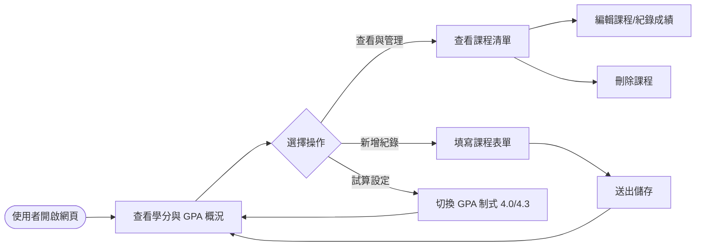
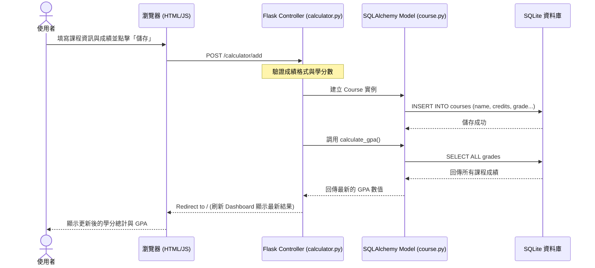

# 流程圖設計 (Flowchart Design)

## 1. 使用者流程圖 (User Flow)

描述使用者進入系統後的主要操作路徑。

```mermaid
flowchart LR
    Start([使用者開啟網頁]) --> Dashboard[查看學分與 GPA 概況]
    Dashboard --> ActionChoice{選擇操作}
    
    ActionChoice -->|查看與管理| List[查看課程清單]
    List --> Edit[編輯課程/紀錄成績]
    List --> Delete[刪除課程]
    
    ActionChoice -->|新增紀錄| AddForm[填寫課程表單]
    AddForm --> AddSubmit[送出儲存]
    AddSubmit --> Dashboard
    
    ActionChoice -->|試算設定| Settings[切換 GPA 制式 4.0/4.3]
    Settings --> Dashboard
```

---

## 2. 系統序列圖 (Sequence Diagram)

以「新增課程紀錄並計算 GPA」為例，展示系統內部的資量流動。

```mermaid
sequenceDiagram
    actor User as 使用者
    participant Browser as 瀏覽器 (HTML/JS)
    participant Flask as Flask Controller (calculator.py)
    participant Model as SQLAlchemy Model (course.py)
    participant DB as SQLite 資料庫

    User->>Browser: 填寫課程資訊與成績並點擊「儲存」
    Browser->>Flask: POST /calculator/add
    Note over Flask: 驗證成績格式與學分數
    Flask->>Model: 建立 Course 實例
    Model->>DB: INSERT INTO courses (name, credits, grade...)
    DB-->>Model: 儲存成功
    Flask->>Model: 調用 calculate_gpa()
    Model->>DB: SELECT ALL grades
    DB-->>Model: 回傳所有課程成績
    Model-->>Flask: 回傳最新的 GPA 數值
    Flask-->>Browser: Redirect to / (刷新 Dashboard 顯示最新結果)
    Browser-->>User: 顯示更新後的學分總計與 GPA
```

---

## 3. 功能清單對照表

| 功能名稱 | 操作說明 | URL 路徑 | HTTP 方法 |
| :--- | :--- | :--- | :--- |
| 儀表板首頁 | 顯示學分統計與 GPA | `/` | GET |
| 課程清單 | 條列所有修課紀錄 | `/courses` | GET |
| 新增課程 | 開啟新增表單頁面 | `/courses/add` | GET/POST |
| 編輯課程 | 更改成績或類別 | `/courses/edit/<id>` | GET/POST |
| 刪除課程 | 移除課程紀錄 | `/courses/delete/<id>` | POST |
| GPA 制式切換 | 切換 4.0 或 4.3 計算 | `/settings/toggle-gpa` | POST |

---

## 4. 流程說明

1.  **初始化**：使用者進入系統後，首頁會自動從資料庫讀取所有紀錄並進行即時彙總。
2.  **即時計算**：為了確保數據準確，每次新增、編輯或刪除後，系統都會重新計算總學分與 GPA，而不是儲存固定的計算結果。
3.  **制式切換**：GPA 計算標準（4.0/4.3）將以 Session 或 User Config 儲存，影響顯示時的轉換邏輯。
